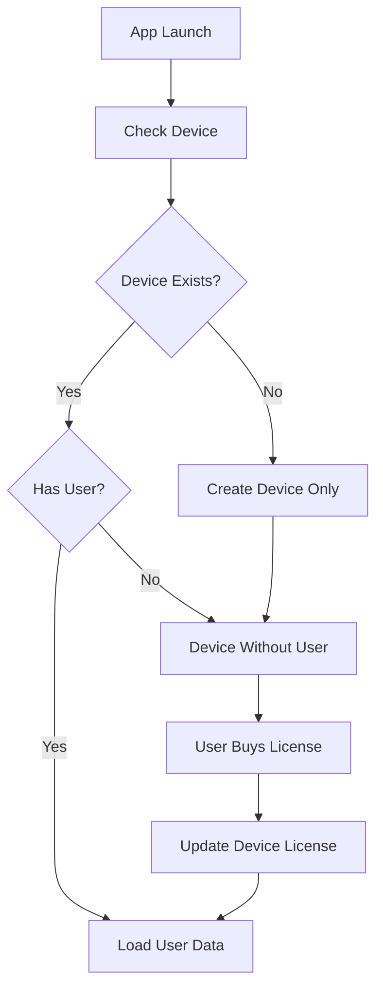

# 👥 User Management API

## 🌳 API Tree
```
/api/users/
├── 🔍 check-device              → GET  → Check device status
├── 📱 create-device             → POST → Create device only
├── 🔧 update-device             → PUT  → Update device license
└── 📉 decrement-free-credits    → PUT  → Decrement free credits
```

---

## 📋 Endpoints

### 🔍 **Check Device**
```http
GET /api/users/check-device?deviceId={deviceId}
```
Check if device exists and get user data.

**Response:**
```json
{
  "success": true,
  "message": "Device ID found in database",
  "data": {
    "id": "clxxxxx",
    "deviceId": "device-123",
    "freeCredits": 100,
    "user": {
      "id": "clxxxxx",
      "email": "user@example.com",
      "name": "John Doe",
      "license": "PRO-KEY-2024"
    }
  }
}
```

---

### 📱 **Create Device Only**
```http
POST /api/users/create-device
```
Creates a device without user (orphaned device).

**Request:**
```json
{
  "deviceId": "device-456",        // Required
  "osVersion": "Android 14",       // Optional
  "model": "Samsung Galaxy S24"    // Optional
}
```

**Response:**
```json
{
  "success": true,
  "message": "Device created successfully",
  "data": {
    "id": "clxxxxx",
    "deviceId": "device-456",
    "osVersion": "Android 14",
    "model": "Samsung Galaxy S24",
    "createdAt": "2024-01-01T00:00:00.000Z"
  }
}
```

---

### 🔧 **Update Device License**
```http
PUT /api/users/update-device
```
Links device to existing licensed user or handles license conflicts.

**Request:**
```json
{
  "deviceId": "device-123",        // Required
  "license": "PRO-KEY-2024"        // Required
}
```

**Response - License Merged:**
```json
{
  "success": true,
  "message": "User updated successfully and license data merged",
  "data": {
    "device": {
      "deviceId": "device-123",
      "user": {
        "id": "clxxxxx",
        "license": "PRO-KEY-2024"
      }
    }
  }
}
```

**Response - License Already Exists:**
```json
{
  "success": true,
  "message": "License key already exists"
}
```

---

### 📉 **Decrement Free Credits**
```http
PUT /api/users/decrement-free-credits
```
Decrements 1 free credit from device. Only used when user has no license.

**Request:**
```json
{
  "deviceId": "device-123"         // Required: device identifier
}
```

**Response - Success:**
```json
{
  "success": true,
  "message": "1 credit decremented successfully",
  "data": {
    "device": {
      "id": "clxxxxx",
      "deviceId": "device-123",
      "freeCredits": 99
    }
  }
}
```

**Response - Insufficient Credits:**
```json
{
  "success": false,
  "message": "Insufficient free credits",
  "data": {
    "freeCredits": 0
  }
}
```

---

## 🔄 User Flow



## 🧪 Quick Test

```bash
# 1. Check device
curl "localhost:3000/api/users/check-device?deviceId=test-123"

# 2. Create device only
curl -X POST localhost:3000/api/users/create-device \
  -H "Content-Type: application/json" \
  -d '{"deviceId":"test-456","model":"iPhone 15"}'

# 3. Update license
curl -X PUT localhost:3000/api/users/update-device \
  -H "Content-Type: application/json" \
  -d '{"deviceId":"test-123","license":"PRO-2024"}'

# 4. Decrement credits
curl -X PUT localhost:3000/api/users/decrement-free-credits \
  -H "Content-Type: application/json" \
  -d '{"deviceId":"test-123"}'
```

## 📊 Response Format

**✅ Success:** `{"success": true, "message": "...", "data": {...}}`
**❌ Error:** `{"success": false, "message": "...", "error": "..."}`