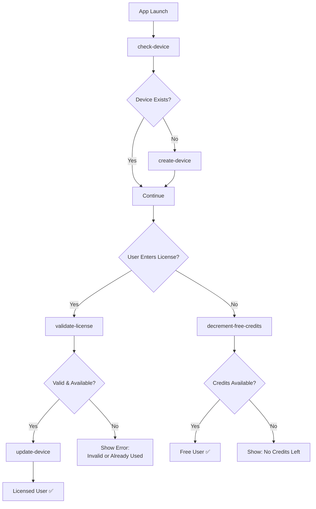

# 👥 User Management API

## 🌳 API Tree
```
/api/
├── 🔑 validate-license          → GET  → Validate license key & availability
└── users/
    ├── 🔍 check-device          → GET  → Check device status
    ├── 📱 create-device         → POST → Create device only
    ├── 🔧 update-device         → PUT  → Link device to license
    └── 📉 decrement-free-credits → PUT  → Decrement free credits
```

---

## 📋 Endpoints

### 🔑 **Validate License**
```http
GET /api/validate-license?license={license}&deviceId={deviceId}
```
Validates a license key against the Polar API and checks if it's available for the specified device.

**Query Parameters:**
- `license` (required): License key to validate
- `deviceId` (required): Device ID to check compatibility

**Response - Valid & Available:**
```json
{
  "success": true,
  "message": "License is valid and available",
  "data": {
    "license": "PRO-KEY-2024",
    "deviceId": "device-123"
  }
}
```

**Response - Already Used on Another Device:**
```json
{
  "success": false,
  "message": "License already used on another device",
  "data": null
}
```

**Response - Invalid License:**
```json
{
  "success": false,
  "message": "Invalid license key",
  "data": null
}
```

---

### 🔍 **Check Device**
```http
GET /api/users/check-device?deviceId={deviceId}
```
Check if device exists and get user data.

**Response - Device Found:**
```json
{
  "success": true,
  "message": "Device found",
  "data": {
    "id": "clxxxxx",
    "deviceId": "device-123",
    "freeCredits": 100,
    "user": {
      "id": "clxxxxx",
      "email": "user@example.com",
      "name": "John Doe",
      "license": "PRO-KEY-2024"
    }
  }
}
```

**Response - Device Not Found:**
```json
{
  "success": false,
  "message": "Device not found",
  "data": null
}
```

---

### 📱 **Create Device Only**
```http
POST /api/users/create-device
```
Creates a device without user (orphaned device).

**Request:**
```json
{
  "deviceId": "device-456",        // Required
  "osVersion": "Android 14",       // Optional
  "model": "Samsung Galaxy S24"    // Optional
}
```

**Response:**
```json
{
  "success": true,
  "message": "Device created successfully",
  "data": {
    "id": "clxxxxx",
    "deviceId": "device-456",
    "osVersion": "Android 14",
    "model": "Samsung Galaxy S24",
    "createdAt": "2024-01-01T00:00:00.000Z"
  }
}
```

---

### 🔧 **Update Device License**
```http
PUT /api/users/update-device
```
Links device to a validated license (should only be called after successful license validation).

**Request:**
```json
{
  "deviceId": "device-123",        // Required
  "license": "PRO-KEY-2024"        // Required
}
```

**Response - Device Linked to License:**
```json
{
  "success": true,
  "message": "Device updated successfully with license",
  "data": {
    "device": {
      "deviceId": "device-123",
      "user": {
        "id": "clxxxxx",
        "license": "PRO-KEY-2024"
      }
    }
  }
}
```

**Response - License Already Assigned:**
```json
{
  "success": true,
  "message": "License key already assigned to this device",
  "data": null
}
```

**Response - Device Not Found:**
```json
{
  "success": false,
  "message": "Device not found",
  "data": null
}
```

---

### 📉 **Decrement Free Credits**
```http
PUT /api/users/decrement-free-credits
```
Decrements 1 free credit from device. Only used when user has no license.

**Request:**
```json
{
  "deviceId": "device-123"         // Required: device identifier
}
```

**Response - Success:**
```json
{
  "success": true,
  "message": "1 credit decremented successfully",
  "data": {
    "device": {
      "id": "clxxxxx",
      "deviceId": "device-123",
      "freeCredits": 99
    }
  }
}
```

**Response - Insufficient Credits:**
```json
{
  "success": false,
  "message": "Insufficient free credits",
  "data": {
    "freeCredits": 0
  }
}
```

**Response - Device Not Found:**
```json
{
  "success": false,
  "message": "Device not found",
  "data": null
}
```

---

## 🔄 Complete User Flow



## 🎯 Edge Cases Covered

### **🔍 Device Management**
- ✅ Device doesn't exist → Create new device
- ✅ Device exists → Continue with existing device
- ✅ Device not found during operations → Return 404 error

### **🔑 License Validation**
- ✅ Valid license + available for device → Allow linking
- ✅ Valid license + already used by same device → Skip linking
- ✅ Valid license + used by different device → Reject (409)
- ✅ Invalid license key → Reject (400)
- ✅ Missing license parameter → Reject (400)

### **📱 Device Linking**
- ✅ License already assigned to this device → Return success message
- ✅ New license assignment → Create user and link device
- ✅ Existing user with license → Link device to existing user

### **💳 Free Credits**
- ✅ Sufficient credits → Decrement and continue
- ✅ Insufficient credits → Block usage and show error
- ✅ Device not found → Return 404 error

## 🧪 Complete Test Flow

```bash
# 1. App Launch - Check if device exists
curl "localhost:3000/api/users/check-device?deviceId=test-123"

# 2. If device doesn't exist, create it
curl -X POST localhost:3000/api/users/create-device \
  -H "Content-Type: application/json" \
  -d '{"deviceId":"test-123","model":"iPhone 15","osVersion":"iOS 17"}'

# 3a. LICENSE FLOW - User enters license
curl "localhost:3000/api/validate-license?license=PRO-KEY-2024&deviceId=test-123"

# 3b. If validation successful, link device
curl -X PUT localhost:3000/api/users/update-device \
  -H "Content-Type: application/json" \
  -d '{"deviceId":"test-123","license":"PRO-KEY-2024"}'

# 4a. FREE FLOW - User wants to use free credits
curl -X PUT localhost:3000/api/users/decrement-free-credits \
  -H "Content-Type: application/json" \
  -d '{"deviceId":"test-123"}'

# 5. Verify final state
curl "localhost:3000/api/users/check-device?deviceId=test-123"
```

## 📊 Response Format

**✅ Success:** `{"success": true, "message": "...", "data": {...}}`
**❌ Error:** `{"success": false, "message": "...", "data": null}`

## 🚨 Error Codes

- **400** - Bad Request (missing/invalid parameters)
- **404** - Not Found (device doesn't exist)
- **409** - Conflict (license already used by another device)
- **500** - Internal Server Error